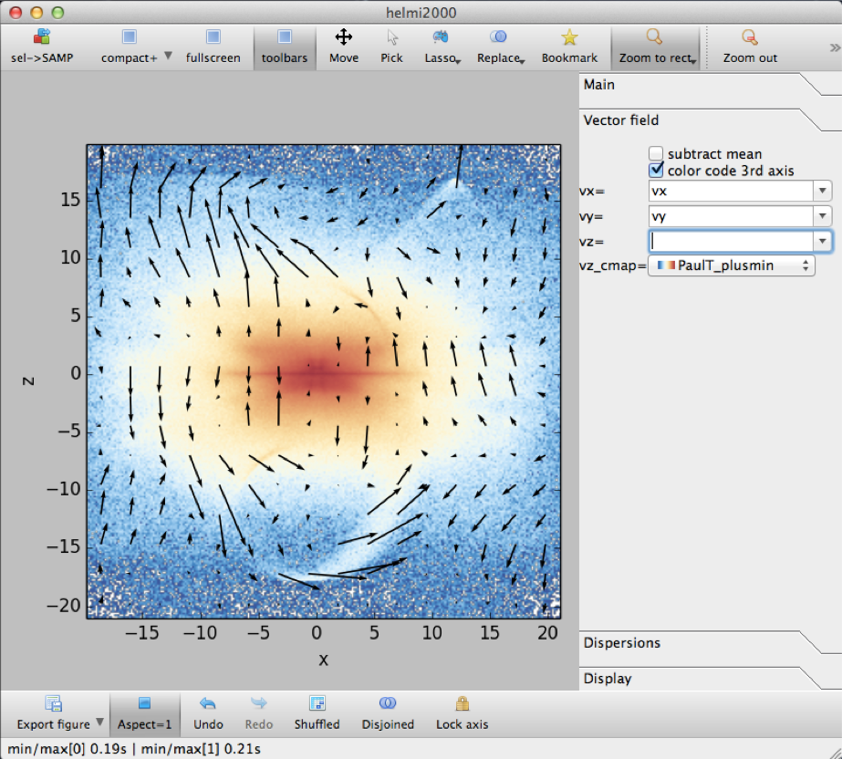
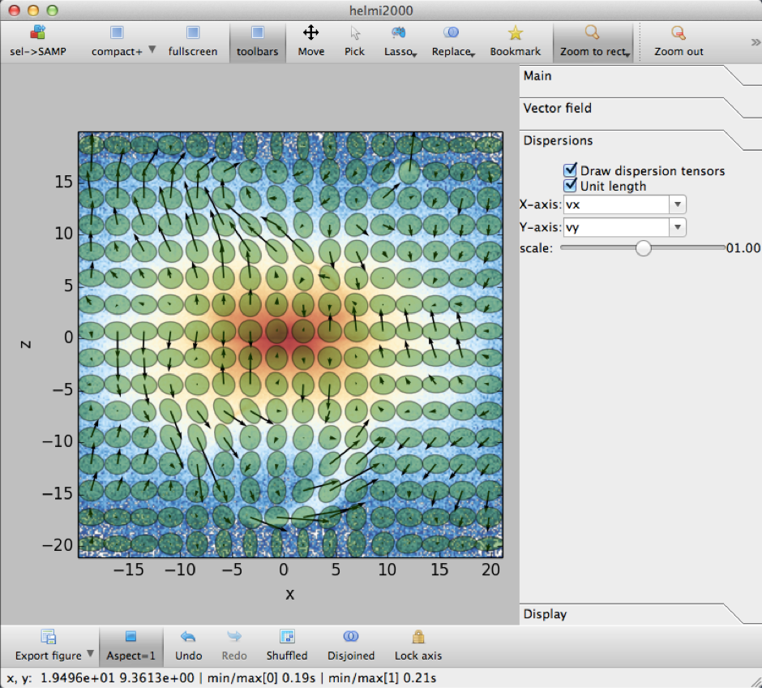

.. _gallery:

Gallery
=======

Screenshots
-----------

    Two dimensional density plot with vector field overlayed, representing the mean velocity.

    Two dimensional density plot with tensor field overlayed, representing the mean velocity dispersion tensor.

.. figure:: images/linked_views.png

    A selection made in one view is also visible in the others.

.. figure:: images/volume_rendering_vector.png

    In three dimensions we use volume rendering. Additionally a vector field can be shown.

Movies
------

.. raw:: html

    <iframe width="560" height="315" src="https://www.youtube.com/embed/oE5jN4zuhH0" frameborder="0" allowfullscreen></iframe>
    <iframe width="560" height="315" src="https://www.youtube.com/embed/An33dYPmgKI" frameborder="0" allowfullscreen></iframe>
    <iframe width="560" height="315" src="https://www.youtube.com/embed/4HHa52Gxn9w" frameborder="0" allowfullscreen></iframe>

