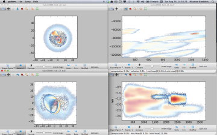

VaeX: Visualization and eXploration
===================================

What is Vaex?
=============

Veax is a graphical tool to visualize and explore large tabular datasets. It mainly renders density plots for visualization in the order of 10\ :sup:`9` rows in the order of 1 second. For exploration it support selection in 1 and 2d, but it can also analyse the columns (dimensions) to find subspaces which are richer in information than others. 

.. image:: images/ss1-small.png

.. :target: images/ss2-large.png

Main features:

* render histograms and density plots (2d histograms), with weights (for average quantities)
* overplot vectors for for instance velocity fields or proper motions.
* use custom expressions, e.g. log(sqrt(x**2+y**2)), calculated on the fly
* publish quality output (using matplotlib)
* linked views:  selecting in 1 view will also select it in different views
* linked axes: zooming, panning or changing the expression for the axis will update all linked axes in different views
* data formats

 * hdf5: gadget, our own format (in the future: other formats can be supported with a few lines of code)
 * fits bintable
 * VOtable over SAMP
 * gadget native format (only singular file supported)

* multidimensional columns: instead or scalars in a column, it can also have arrays, so time series are possible, simple movie support.
* ranking of subspaces: for 2 and 3 dimensional subspaces, a ranking can be calculated that indicates the relative richness of structure and/or correlation in them.
* easily showing a fraction of the data: if the rows are uncorrelated in order (random order), a subset of the data can be shown using a slider (which can make the program more responsive)
* exporting data: the selected data can be exported for further analysis
* undo/redo: a mistake in selection or navigation can quickly be undone using undo

Quickstart
==========

:ref:`installing_from_binary`, unzip it at any location. OSX users can simply double click the unzipped file, Linux users should run the binary from the unzipped dir (./vaex/veax). Vaex comes with some example datasets. Click/select one of interest, and now click the 'x/y density' button on the right panel. Keep the button pressed to plot anything else but the first two columns. A density plot should now appear.

By default the move mode is selected (as indicated by the selected button in the toolbar in the upper left corner). Dragging (keeping the mouse button pressed and moving) will move the density plot around, scrolling will zoom in and out. Selecting the next button (Pick), or by typing 'p', will enable pick mode, clicking the mouse button will select the nearest row under the cursor, and it will be highlighted as a red dot. Opening up any other plot, or the table will show the same row as selected, which is useful for checking outliers. 

Clicking the next button on the toolbar (or type l), will select the lasso selection tool. Draw a line around a region of interest to select rows inside it, again it will be selected in other plots as well. Use the x-range or y-range selection by keeping the button pressed for longer (or type x or y), and use it in combination with the different selection modes (and, or, replace: next button in the toolbar, or type &, | or =) for more advanced selections. 

Guide
^^^^^

Contents:

.. toctree::
   :maxdepth: 3
    
   installing
   reference
   tipsandfaq
   credits
	

Indices and tables
==================

* :ref:`genindex`
* :ref:`modindex`
* :ref:`search`

