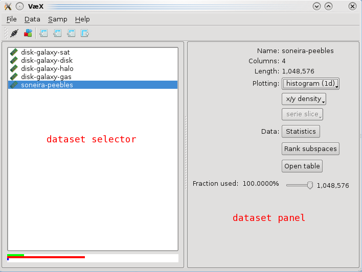
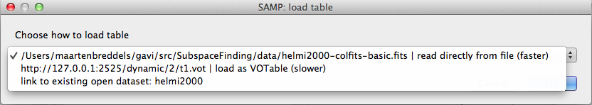
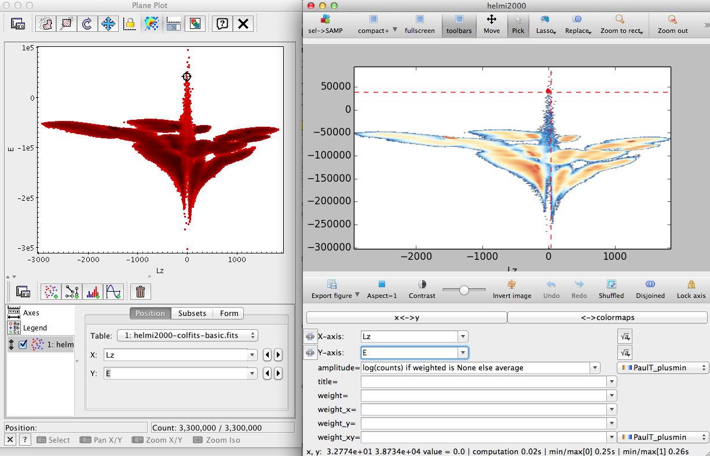
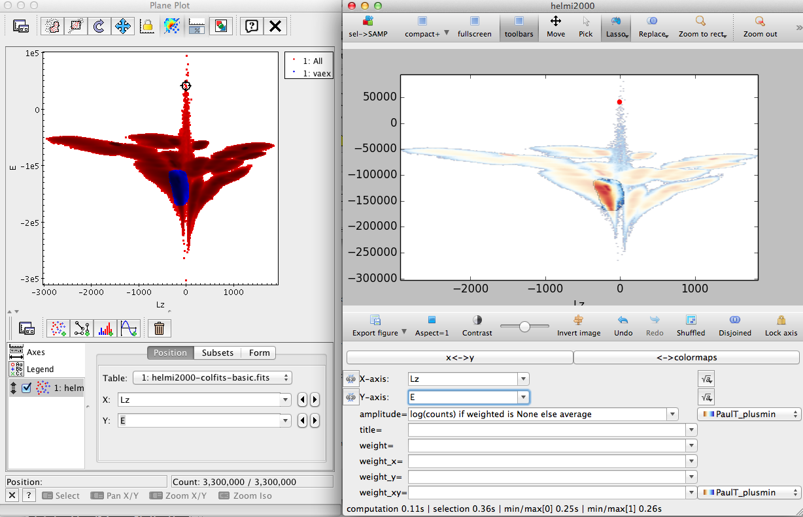

Reference
=========

Command line options
--------------------

Vaex can handle command line options to quickly open files and make plots, the syntax is:

.. code-block:: python
	
	vaex <filename> <expr1> <expr2> [name=value ...] - <expr3> <expr4>... 	-- <filename2> <expr5> <expr6>... 

In short, start with a filename, then enter expressions (1 expression will open a histogram, 2 a density plot), optionally folowed by key value pairs to change the settings of the plot, plots are seperator by a minus sign '-', datasets are seperated by two minus signs '--'. Examples:

.. code-block:: python
	
	vaex mydataset.hdf5 x y
	vaex mydataset.hdf5 x y amplitude="log(counts+1)" weight=temperature
	vaex mydataset.hdf5 x y - x z -- otherdataset.hdf5 teff logg - J-K M_J

Filename can be any of the supported :ref:`filetypes <supported-files>`. The (column) :ref:`expression <column-expressions>` are the same as in the graphical interface.

Key, value pairs correspond to the GUI. For example, plotting the log of the average temperature with a different colormap:

.. code-block:: python

	vaex mydataset.hdf5 x y amplitude="log(counts+1)" weight=temperature colormap=afmhot

Possible options are:
 
 - amplitude: :ref:`grid expression <grid-expressions>`, examples: "log(counts+1)", "sqrt(counts)", average**2 (NOTE: expressions that include parenthesis are enclosed in quotes  to avoid the shell from interpreting them.
 - weight: column expression for the weighted grid, if this is specified, also average is available as a grid (see :ref:`grid expression <grid-expressions>`). Examples are: weight=temperature, weight=vx**2
 - wx, wy, wxy: :ref:`column expression <column-expressions>` for the x and y and color component of the vector field. Example: wx=vx wy=vy wxy=vz
 - colormap (or cmap, colourmap): name of the colormap, a list is visible in the GUI. Examples cmap=afmhot cmap=bwr, cmap=rainbow cmap=jet
 - colormapxy (or cmapxy, colourmapxy): colormap for the arrows for the vector field.
 - xlim: limits for x axis. Example xlim=-10,10  xlim=40+5,50+5
 - ylim: limits for y axis
 - aspect: sets the aspect of the plot, only aspect=1 is supported
 - compact: removes many parts of the GUI apart from the plot, options are 'normal' and 'ultra'. Examples: compact=normal compact=ultra

 
Main window
-----------

	

Dataset selector
^^^^^^^^^^^^^^^^

Dataset panel
^^^^^^^^^^^^^^^^

Plotting
--------

x/y density
^^^^^^^^^^^

rank subspaces
^^^^^^^^^^^^^^

Other options
-------------

SAMP support
^^^^^^^^^^^^

.. |icon_connect| image:: icons/plug-connect.png

.. |icon_samp_send| image:: block--arrow|

Vaex supports `SAMP <http://www.ivoa.net/documents/SAMP/>`_ to communicate and interoperate with other applications. Since vaex focusses on large datasets, the method of transferring data using VOTables is not recommended (although supported, it can be quite slow). For this example we assume that you have a working version of `TOPCAT <http://www.star.bris.ac.uk/~mbt/topcat/>`_ (version 4.2 was used at the time of writing) and that you have your dataset in both fits format (or any other format TOPCAT can read), and a hdf5 file (say mydata.fits and mydata.hdf5). Start TOPCAT with the SAMP hub enabled (the default in version 4.2), and open the fits file. Start vaex and open the hdf5 file. When vaex is started, it tries to connect to the SAMP hub directly, which you can verify by checking if connect icon in the toolbar |icon_connect| is selected, or the menu option "SAMP"->"Connect to SAMP hub" is checked. In case you started TOPCAT after you started vaex, you can connect to the SAMP hub using the connect icon |icon_connect|, or from the menu "SAMP"->"Connect to SAMP hub". Now both TOPCAT and vaex are connected to the SAMP hub (which is started by TOPCAT), and should be able to send eachother messages. 

From SAMP, broadcast the table (mydata.fits) by clicking the broadcast icon |icon_topcat_broadcast| or from the menu "Interop"->"Send table to"->"vaex". A popup should appear in vaex asking what it should do. The first option is to read the fits file (although vaex supports fits files, we don't recommend using them, see `filetypes <supported-files>`). Another options is to download is as a VOTable (only do this for small datasets, max 100 000 rows). There should also be an option to link it to an existing open dataset, choose that option

	Options in vaex when a VOTable is broadcasted.

Now that TOPCAT and vaex are both connected to the SAMP hub and both datasets are 'linked', open the same or a simular plot in both topcat and vaex. Select the pick mode in vaex by clicking the pick icon in the toolbar |icon_pick|, or pressing 'p'. Now pick an object/row, and it should be selected in both vaex and TOPCAT, as shown below.

	Picking an object in vaex will also select it in TOPCAT.

To enable it visa versa, make sure that you select "Broadcast row" in TOPCAT's main window.

Now do a lasso selection in vaex, and click the 'icon_samp_send' 

	Selections can be send from vaex to TOPCAT and visa versa.

To send a selection from TOPCAT, click the lasso icon in the toolbar, draw the region, click the icon again and choose "Transmit Subset"

.. _column-expressions:

Column expressions
------------------

The expressions for columns can are similar to mathematical expressions in most programming languages, examples are:

.. code-block:: python
	
	sqrt(x**2 + y**)
	arctan2(y,x)
	log(x+1)

A list of all mathematical functions can be found here: https://github.com/pydata/numexpr#supported-functions.

.. _grid-expressions:

Grid expressions
------------------

The expressions for grids are pure Python expressions. For the amplitude the following variables are available:

 -counts: grid which contains the histogram counts for the columns.
 -weighed: sum of the quantity as given by the weight field.
 -average: weighted/counts where counts is greater than zero. This evaluates to the average of the quantity as given in the weight field.
 -peak_column: grid where column contains the peak value per column, giving by this grid sets the peak value of every column to 1, e.g: counts/peak_column, average/peak_column
 -peak_rows: similar, but now per row.
  
All functions in the numpy packages are available, where http://docs.scipy.org/doc/numpy/reference/routines.math.html describes the most useful. In addition, these functions are avaiable:

 - gf: gaussian filter, example gf(log(counts+1),1.), alias to http://docs.scipy.org/doc/scipy/reference/generated/scipy.ndimage.filters.gaussian_filter.html. Convolves the grid (first argument) with a multidimensional gaussian with a sigma given as second argument. Sigma is in pixel or voxel units, and if a number is given as argument it is taken for all the dimensions, gf(log(counts+1), [2.,1.]) will convolve with a gaussian which is wider in the vertical (y) direction.

Some examples are:

 - log(counts) if weighted is None else average (default): this evaluates of counts if the expression ' weighted is None' is True, otherwise average. This will then show the average  when the weight field is filled in, otherwise log(counts)
 - counts/peak_column
 - clip(counts/counts/max(), 0, 1)

.. _supported-files:

Supported filetypes
-------------------

Supported filetypes are:

 - hdf5: This fileformat is a hierarchical format, similar to html/xml, except that it can store data in native format. Since it is so flexible, there are no standard ways of how to store tabular data. We chose the following format:
   
   - '/columns' Under this group, we store all the columns
   - example: '/columns/x' This would be where a hdf5-dataset would be store for the columnname 'x', supported types are floats and integers.

  The big advantage of using hdf5 is that the file can be memory mapped, meaning no copies of the data to main memory need to be made. This also makes it possible to use data that is larger than main memory.
 
 - fits: Using the binary table extension, a fits file can store binary data. Fits however stores the data in big endian format, x86 cpus (intel, amd) use low endian format, this causes a small overhead for conversion. Also, storage is row based, which can lead to overhead in reading. We recommend exporting to hdf5 using our program for beter performance.
 
 - Gadget hdf5 file: File format of Gadget2, splitted files are not yet supported

 - VOTable: Although supported, all records are kept in memory and read performance is quite poor. Only use this for small datasets, and otherwise export to hdf5 

